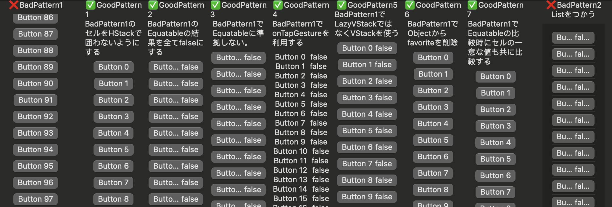

# 概要
LazyVStackで、Equatableな要素View内に実装したボタンタップ時に要素ごとに渡されたオブジェクトにアクセスすると意図しない他のオブジェクトになっている現象の調査解決


# 暫定の結論

Button.actionが不要に残ってしまうバグ。
Button.actionを使わずにonTapGestureを使うことで解決できる。

もしくは、Buttonを使用してEquatableに準拠しないのも手。
理由はEquatableを実装しなかったとしても、セルが再利用されることにより、updateされるセルはView上で目視できているセルに限られるので、全体更新で処理が重くなるといったことが無いため。

以前間違った結論としてUniqueな情報をEquatableに含めるというものを提案したが、これでは結局比較結果がfalseになり局所アップデートにならない。

<details>
<summary>間違った結論</summary>
> Xcode15からLazyVStack内の要素が再利用される挙動っぽくて、その都合でEquatableの比較時にオブジェクトの一意な情報も比較することで想定どおりの挙動になる。
> また、Listでも再利用されるっぽいので同じように実装する必要あり。

> 公式の仕様については探し中

> ```diff
> static func == (lhs: Self, rhs: Self) -> Bool {
> return lhs.object.favorite == rhs.object.favorite
> +             && lhs.object.id == rhs.object.id
>     }
> ```
</details>


# 調査
様々なパターンで実装して確かめた。


## 環境
* 2.3 GHz 8-Core Intel Core i9
* MacOS Sonoma 14.0
* Version 15.0 (15A240d)

# 補足
上記の対応をしない状態でも、以下のような変更をすることで何故か不具合が起きなくなったので困惑した。
* 要素内でHStackで囲わないようにする

