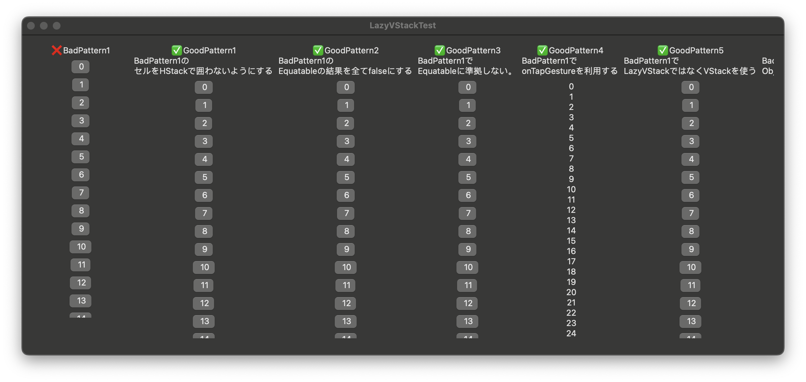

# 概要
LazyVStackで、Equatableな要素View内に実装したボタンタップ時に要素ごとに渡されたオブジェクトにアクセスすると意図しない他のオブジェクトになっている現象の調査解決

# 結論
Xcode15からLazyVStack内の要素が再利用される挙動っぽくて、その都合でEquatableの比較時にオブジェクトの一意な情報も比較することで想定どおりの挙動になる。

公式の仕様については探し中

```diff
static func == (lhs: Self, rhs: Self) -> Bool {
    return lhs.object.favorite == rhs.object.favorite
+             && lhs.object.id == rhs.object.id
    }
```

# 調査
様々なパターンで実装して確かめた。


## 環境
* 2.3 GHz 8-Core Intel Core i9
* MacOS Sonoma 14.0
* Version 15.0 (15A240d)

# 補足
上記の対応をしない状態でも、以下のような変更をすることで何故か不具合が起きなくなったので困惑した。
* 要素内でHStackで囲わないようにする
* Button.actionを利用せずにonTapGestureを利用する

